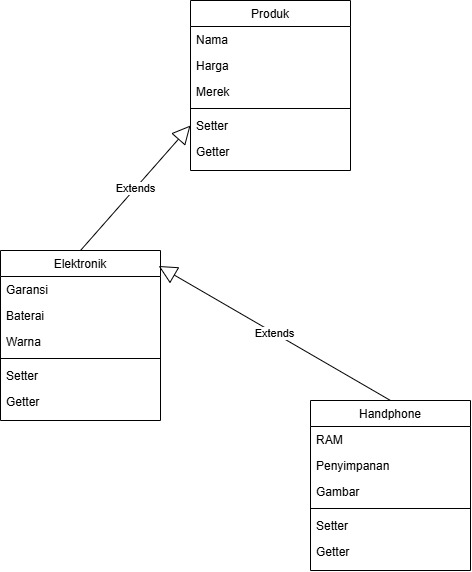

# Janji
Saya Nezhad Ahmad Maliki dengan NIM 2503880 mengerjakan Tugas Praktikum 2 pada Mata Kuliah Desain dan Pemrograman Berorientasi Objek (DPBO) untuk keberkahan-Nya maka saya tidak melakukan kecurangan seperti yang telah dispesifikasikan. Aamiin

# Struktur File

```
C:.
│   Diagram.drawio
│   Diagram.jpg
│
├───cpp
│       Elektronik.cpp
│       Handphone.cpp
│       Main.cpp
│       Produk.cpp
│       TESTCASE.txt
│
├───Dokum
│   ├───Dokum cpp,java,python
│   │       Proses Input.png
│   │       Tampilan sebelum.png
│   │       Tampilan sesudah.png
│   │
│   └───Dokum php
│           display gambar sebelum.png
│           display gambar sesudah.png
│           form tambah data.png
│           foto input.jpg
│           list sebelum.png
│           list sesudah.png
│           Tampilan Utama.png
│
├───java
│       Elektronik.java
│       Handphone.java
│       Main.java
│       Produk.java
│       TESTCASE.txt
│
├───php
│   │   Elektronik.php
│   │   Handphone.php
│   │   Main.php
│   │   Produk.php
│   │   style.css
│   │   TESTCASE.txt
│   │
│   ├───Media
│   │       ip16.jpg
│   │       pixel9.jpg
│   │       rog.jpg
│   │       s25.jpg
│   │       xiaomi14.jpg
│   │
│   └───uploads
│           ip17.jpg
│
└───python
        Elektronik.py
        Handphone.py
        Main.py
        Produk.py
        TESTCASE.txt
```

# Desain & Alur Program



### 1. Desain Class `Produk`
Semua atribut yang ada di class dibikin private. Jadi kalau mau ngambil atau ngubah nilainya, harus lewat method getter dan setter:
- `nama` (string): 
- `Harga` (string): 
- `Merek` (int): 

### 2. Desain Class `Elektronik`
Semua atribut yang ada di class dibikin private. Jadi kalau mau ngambil atau ngubah nilainya, harus lewat method getter dan setter:
- `Garansi` (string): 
- `Baterai` (string): 
- `Warna` (string): 

### 3. Desain Class `Handphone`
Semua atribut yang ada di class dibikin private. Jadi kalau mau ngambil atau ngubah nilainya, harus lewat method getter dan setter:
- `RAM` (string): 
- `Penyimpanan` (string):
- `gambar` (string, khusus PHP): Path file poster film yang disimpen di folder lokal `image/`.

### 4. Alur Program (Flow Kode)

Jadi pada program ini terdapat 3 class yang memiliki relasi multilevel inherintance yaitu class Produk yang menjadi induk utamanya dan class elektronik sebagai anak pertama atau turunan pertama dari class produk dan yang terakhir ada class handphone yang menjadi turunan dari class elektronik dan cucu dari class produk. Pada program ini hanya terdapat 2 fitur yaitu tambah data dan menampilkan data.

Pada fitur Tambah Data, user dapat memasukkan data Handphone baru dengan mengisi atribut yang tersedia, yaitu nama, harga, merek, garansi, baterai, warna, RAM, penyimpanan, dan gambar Handphone. Setelah seluruh data selesai dimasukkan, program membuat objek Handphone baru menggunakan data tersebut dan menambahkannya ke dalam daftar Handphone.

Pada fitur Tampilkan Data, program akan mengambil seluruh data Handphone yang tersimpan dengan melakukan perulangan pada daftar Handphone. Setiap atribut Handphone diambil menggunakan method getter, kemudian ditampilkan dalam bentuk tabel agar informasi mengenai stok Handphone lebih mudah dibaca dan dipahami.

# Dokumentasi

## C++, PHP, PYTHON

| Tampilkan Data Awal | Contoh Input | Tampilkan Data Setelah Input |
| :---: | :---: | :---: |
|  |  |  |

## PHP

| Tampilan Utama | Display Sebelum Input | Display Sesudah Input |
| :---: | :---: | :---: |
|  |  |  |
| **Form Tambah Data** | **List data Sebelum Input** | **List data Sebelum Input** |
|  |  |  |
